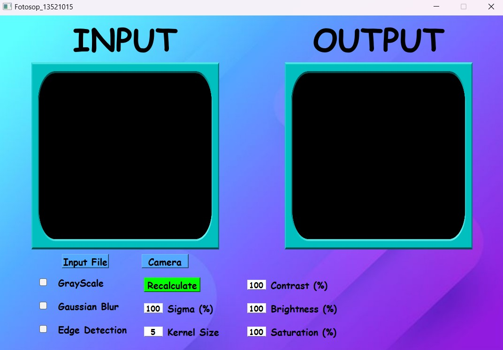
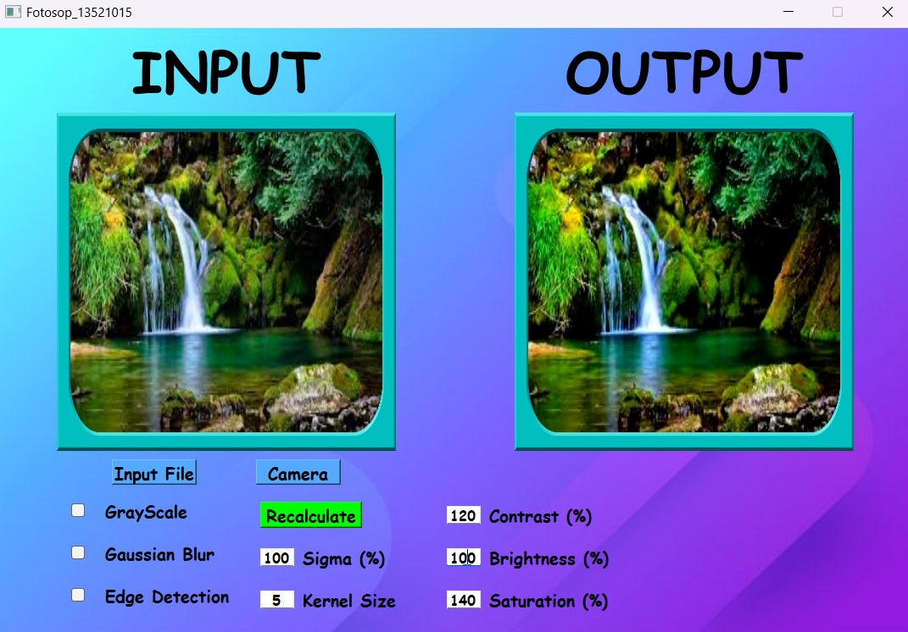
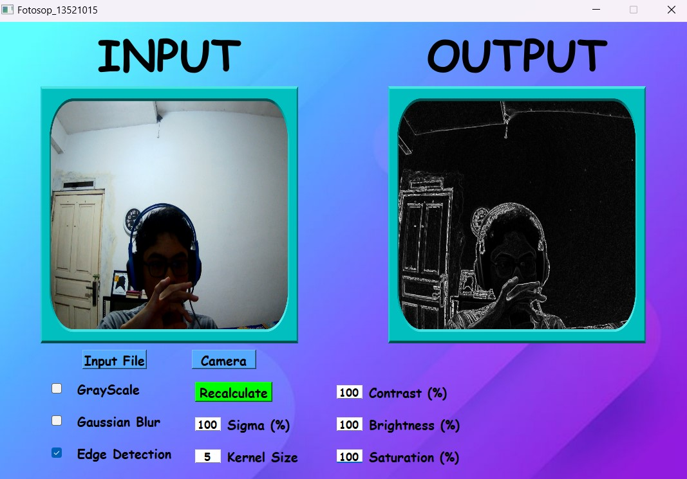

# Fotosop 13521015

Fotosop 13521015 is a Python application with a graphical user interface (GUI) that allows users to apply various filters to images captured from the camera or loaded from files. The application provides options to adjust contrast, saturation, brightness, grayscale, Gaussian blur, and edge detection filters.

## Table of Contents

- [Overview](#overview)
- [Preview](#preview)
- [Development Environtment](#development-environment)
- [Installation](#installation)
- [Usage](#usage)
- [Available Filters](#available-filters)
- [Contributing](#contributing)

## Overview

Fotosop 13521015 is a user-friendly image processing application that provides real-time camera preview and image file processing capabilities. Users can select filters and adjust parameters to modify the appearance of images captured from the camera or loaded from files. The application offers the flexibility to enhance images and experiment with different filters to achieve desired effects.

## Preview




## Development Environment
This program was developed using:
- Python 3.11.3 
- PyQt5 5.15.9 
- numpy 1.24.2
- opencv-python 4.8.0.76
- Windows 11

The application was tested on Windows 11.

## Installation
1. **Install Python:** Install Python 3.7 or higher from the [official website](https://www.python.org/downloads/). Make sure to add Python to your PATH environment variable during installation.
1. **Clone the Repository:** Clone or download this repository to your local machine
2. **Install Dependencies:** Install the required Python libraries using pip:
    ```bash
    pip install opencv-python-headless pyqt5
    ```

3. **Run the Application:** Execute the application by running the following command:
    ```bash
    cd src
    python main.py
    ```

## Usage
1. **Camera Preview:** Click the "Camera" button to activate the camera preview in the left image frame (IMAGE_INPUT_CAMERA). Adjust filters in real-time using the provided options.

2. **Image Input:** Click the "Input Image" button to select an image file from your file system. The selected image will be displayed in the left image frame (IMAGE_INPUT).

3. **Filter Adjustment:**Adjust the filter options on the right side to modify the appearance of the input image or camera preview.

4. **Recalculate:** Click the "Recalculate" button to reapply filters to the input image (non-camera mode) and display the result in the right image frame (IMAGE_OUTPUT).

## Available Filters
- **Contrast:** Adjust the contrast of the image. Values can be entered as percentages.

- **Saturation:** Modify the color saturation of the image. Values can be entered as percentages.

- **Brightness:** Adjust the brightness of the image. Values can be entered as percentages.

- **Grayscale:** Enable grayscale mode to convert the image to black and white.

- **Gaussian Blur:** Apply Gaussian blur to the image. Specify the kernel size and sigma value.

- **Edge Detection:** Apply edge detection using the Sobel operator.

## Contributing
Contributions are welcome! If you encounter any issues, have suggestions for improvements, or want to add new features, feel free to create a pull request.